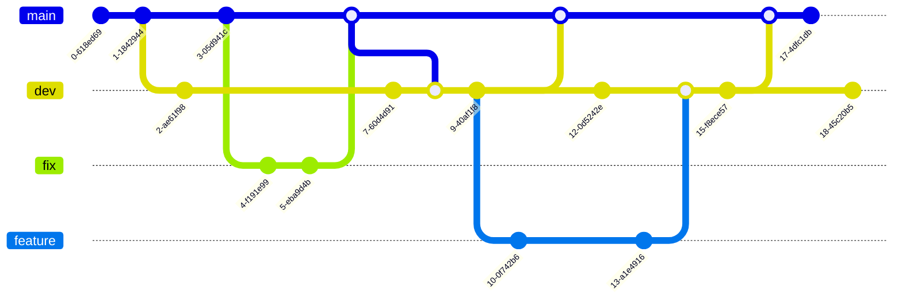

# 開發分支

## 版本對應

雙主幹原則

| 版本 | 部署目標 |
| :---: | :---: |
| main (master) | 正式機 |
| dev | 測試機 |
| fix | 無 |
| feature | 無 |

## 分支路線

```mermaid
gitGraph
  commit
  commit
  branch dev
  commit
  checkout main
  commit
  branch fix
  commit
  commit
  checkout main
  merge fix
  checkout dev
  commit
  merge main
  commit
  branch feature
  commit
  checkout main
  merge dev
  checkout dev
  commit
  checkout feature
  commit
  checkout dev
  merge feature
  commit
  checkout main
  merge dev
  commit
  checkout dev
  commit

```
